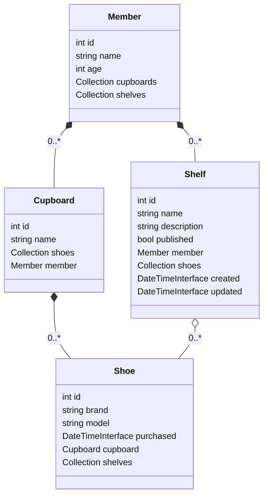

# 🛜 Projet Developpement Web: Trail Running Shoes

## 👟 Description
As a trail runner I really want to know the best shoes to buy. In order to perform an educated purchase I need to know what each model feels on the long run: How light are the shoes? Are they comfortable? Do they have a good grip? On rock? On dirt? What about rainning conditions? Will my ankle feel supported? Which size should I get?

Trail Running Shoes (TRS) is a community based website rencensing relevant data about trail running shoes. Athletes can share feedbacks, feelings or technical details about the shoes they own (and store in a cupboard) and browse the thoughts of other trail runners about other running sneackers. All athletes can easily display their favorite (or worst) shoes on a special shelf.

## ⚙️ Technical Description
Created using:
- php v8.1.2
- Symfony v6.3.4
- Tested with Mozilla Firefox v117.0 on Ubuntu 22.04 LTS

Association table between the type of entities in the data sheet, their real-life counterpart and the name used in the code:
| Entity Type |    Entity    |   Class Name   |
|-------------|--------------|----------------|
| Member      | Trail Runner |   **Member**   |
| Object      |  Trail Shoes |    **Shoe**    |
| Inventory   |   Cupboard   |  **Cupboard**  |
| Galerie     |     Shelf    |   **Shelf**    |

Class diagram:


## 📝 Step-by-step Description
See *CHECKLIST.md* for more details.

### Step 1: New Symfony Project
- [x] Read technical specifications
- [x] Choose domain
- [x] Initialise working directory
- [x] Create new Symfony project

### Step 2: First Entities
- [x] Prepare to add first entities
- [x] Configure database
- [x] Add support for data-fixtures
- [x] Add object (**Shoe**) and inventory (**Cupboard**) entities to data model
- [x] Add test data

### Step 3: EasyAdmin interface & CRUD controllers
- [x] Add main CRUD controller
- [x] Add inventory (**Cupboard**) CRUD controller
- [x] Add object (**Shoe**) CRUD controller

### Step 4: Add Member Entity
- [x] Add member (**Member**) entity
- [x] Add member-inventory link
- [x] Add member (**Member**) CRUD controller

### Step 5: First Public Pages
- [x] Add inventory (**Cupboard**) controller
- [x] Add method to display list inventories (**Cupboard**)
- [x] Add method to browse an inventory (**Cupboard**)
- [x] Add link to browse in the displayed list of inventories (**Cupboard**)

### Step 6: OneToMany Relations Administration Board
- [x] Add administration table for OneToMany relations

### Step 7: Administration Board Improvements
- [x] Improve administration board

### Step 8: Current Entities Administration Board
- [x] Add CRUD controller for all entities

### Step 9: Pages Gabarits & Front-Office Display
- [x] Add display of an object (**Shoe**) inside an inventory (**Cupboard**) in the front-office

### Step 10: Back-Office Display
- [x] Add page to display inventory (**Cupboard**)
- [x] Add list of the entities in the page

### Step 11: CSS
- [x] Download and integrate Bootstrap in templates
- [x] Add menus for Bootstrap

### Step 12: Add Galery Entity
- [x] Add galery (**Shelf**) entity

### Step 13: Galery Administration Board
- [x] Add galery (**Shelf**) entities to administration board

### Step 14: Galery Front-Office CRUD Controller
- [x] Add new CRUD controller for galeries (**Shelf**)
- [x] Improve display

### Step 15: Front-Office Symfony Controllers Modifications Methods
- [ ] ...

### Step 16: Galery Browsing
- [ ] ...

### Step 17: Acces Contextualisation & Permited Operations Restrictions
- [ ] Add CRUD controller for member entity
- [ ] Contextualise inventory (**Cupboard**) creation
- [ ] Contextualise object (**Shoe**) creation
  
### Step 18: Galerie's Objects Management
- [ ] Contextualise galery (**Shelf**) creation
- [ ] Contextualise public galeries (**Shelf**) display
- [ ] Contextualise adding an object (**Shoe**) to a galery (**Shelf**)

### Step 19: Authentification
- [ ] Add authentification

### Step 20: Acces Control
- [ ] Read only access for members
- [ ] Consulatation only access for owner and administrator
- [ ] Write access to data owner
- [ ] Access to non-public galeries (**Shelf**)
- [ ] Access to objects (**Shoe**) inside non-public galeries (**Shelf**)

### Step 21: Data Loading Contextualisation
- [ ] Galeries (**Shelf**) display
- [ ] Objects (**Shoe**) and inventories (**Cupboard**) display

### Step 22: Data Removal
- [ ] Remove objects (**Shoe**) from deleted inventories (**Cupboard**)
- [ ] ManyToMany relations management

### Step 23: Have fun !!

## 🔗 Useful Links
- [GitHub Repository](https://github.com/FABallemand/ProjetDeveloppementWeb)
- [Symfony Documentation](https://symfony.com/doc/current/index.html)
- [Symfony Documentation: Databases and the Doctrine ORM](https://symfony.com/doc/current/doctrine.html)
- [Doctrine ORM Documentation](https://www.doctrine-project.org/projects/doctrine-orm/en/2.16/index.html)

## ⌨️ Useful Commands (for developpement purpose...)

1. Symfony version
```bash
symfony console -V
```
2. List available Symfony commands
```bash
symfony console list
symfony console list app
```
3. Informations related to the environment
```bash
symfony console about
```
4. Help
```bash
symfony console help [command]
```
5. Create Database
```bash
symfony console doctrine:database:create
symfony console doctrine:schema:create --dump-sql
symfony console doctrine:schema:create
```
6. Update Database
```bash
symfony console doctrine:schema:update
```
7. Delete Database
```bash
symfony console doctrine:database:drop --force
```
8. Load Data Fixtures
```bash
symfony console doctrine:fixtures:load -n
```
9. Do 7, 5 and 8 🚀
```bash
make reload_fixtures
```
10. Access Symfony logs
```bash
tail -f var/log/dev.log # doctrine.DEBUG tags
```
11. Clean Symfony project
```bash
symfony console cache:clear
rm -fr .project .settings/
```
```bash
make clean
```
12. Really clean Symfony project
```bash
symfony console cache:clear
rm -fr composer.lock symfony.lock vendor/ var/cache/
rm -fr .project .settings/
```
```bash
make deep_clean
```
13. Create and test project archive in Download folder
```bash
make prepar_to_send
```

## 📋 Notes
- Create and link entities -> TP2
- Create and improve commands (ordered listings, entity creation, relations and uniqueness constraint...) -> TP2
- Command arguments (list by year, unique...) -> TA1
- Orphan removal -> TA1
- TODO: error edit shoe
- TODO: shelf single shoe
- TODO: edit page not pretty
- TODO: issue with data fixtures for shelves

## 👤 Author
- Fabien ALLEMAND